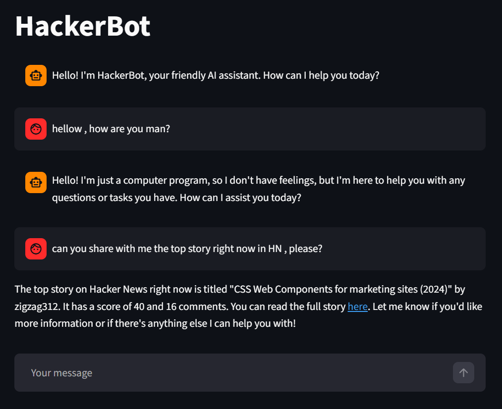
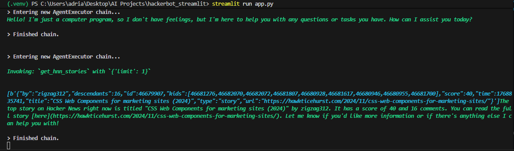

# NewsNerd HackerBot 🤖📰

Greetings, fellow news nerds! Welcome to the NewsNerd HackerBot, your ultimate companion for hacking into the latest tech scoops on Hacker News! 🕵️‍♂️💬



## Features 🚀
Right now, NewsNerd HackerBot is able to:

- Get you the top, best, new, ask, show, and job stories of Hacker News.
- Filter the stories by any keyword/keywords you want (e.g., Give me 20 stories about Sam Altman and OpenAI).
- Extract the comments from a story. You can use this to evaluate the general sentiment of the story.
- Read blogs/articles linked to a story in order to reason about them.

---

## Local Use

**Install dependencies:**

```sh
pip install -r requirements.txt
```

**Run Streamlit application:**

```sh
streamlit run app.py
```


